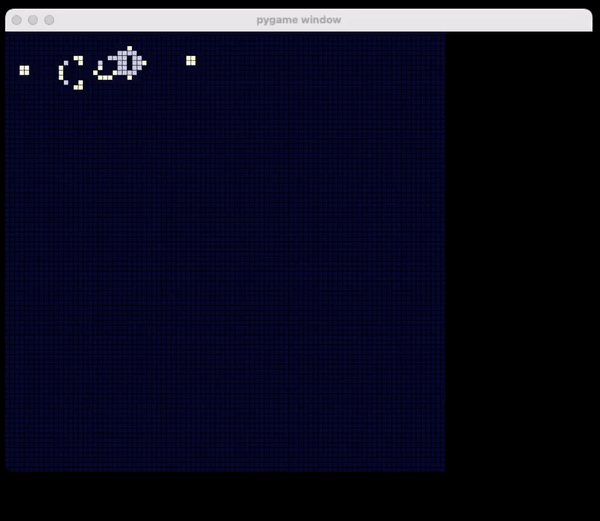

# game_of_life
Just for fun

    

# TODO
1. Add bar that controls display speed
2. Add color legend
3. Add control button
4. Add reset button
5. Optimize code structure
6. Improve code readability
7. Add more patterns
